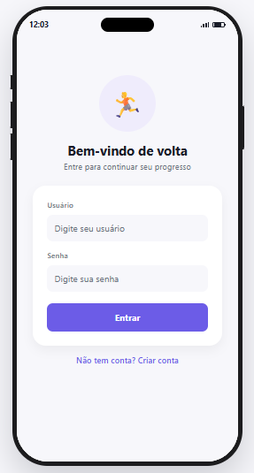
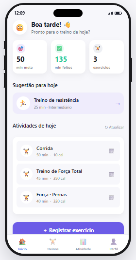
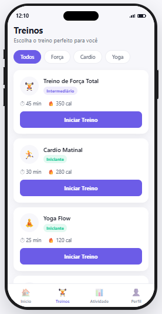
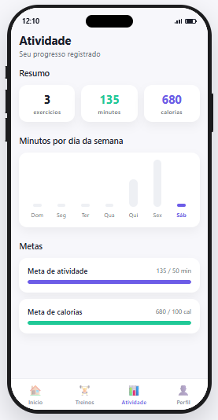
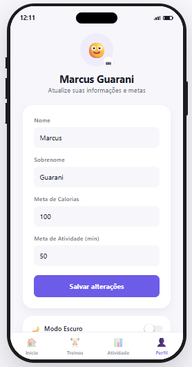
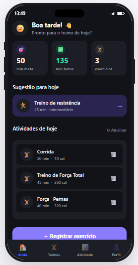

<h1 align="center">🏋️ Fitness App — React Native + Flask</h1>

Aplicativo de acompanhamento de treinos e atividades físicas, com front-end em **React Native (Expo)** e uma API REST construída em **Python + Flask**.

> **Projeto adaptado** a partir de dois repositórios originais do desenvolvedor [avigael](https://github.com/avigael):
> [react-native-fitness-app](https://github.com/avigael/react-native-fitness-app) (front-end) e
> [fitness-shopping-rest](https://github.com/avigael/fitness-shopping-rest) (back-end).
> Todo o crédito pela concepção original — estrutura de telas, modelo de dados e a API — é dele.
> Veja a seção [O que foi adaptado](#-o-que-foi-adaptado) para saber o que mudou nesta versão.

<h2 align="center">Capturas de tela</h2>

<p align="center">
<table>
  <tr>
    <td align="center"><br>Login</td>
    <td align="center"><br>Início</td>
    <td align="center"><br>Treinos</td>
  </tr>
  <tr>
    <td align="center"><br>Atividade</td>
    <td align="center"><br>Perfil</td>
    <td align="center"><br>Modo Escuro</td>
  </tr>
</table>
</p>

## 🚀 Tecnologias

**📱 Front-end**
- React Native + Expo (SDK 39)
- React Navigation (Stack + Bottom Tabs)
- React Context API (autenticação, foto de perfil e modo escuro compartilhados entre telas)

**⚙️ Back-end**
- Python + Flask
- Flask-SQLAlchemy — persistência em SQLite
- PyJWT — autenticação por token

## 🏗️ Arquitetura

```
┌──────────────────────────┐
│      Aplicativo Mobile   │
│   React Native (Expo)    │
│   Web / iOS / Android    │
└────────────┬─────────────┘
             │
             │ HTTP / REST API + token JWT
             ▼
┌──────────────────────────┐
│         Back-end         │
│      Python + Flask      │
└────────────┬─────────────┘
             │
             ▼
┌──────────────────────────┐
│      SQLite (SQLAlchemy) │
└──────────────────────────┘
```

## 📂 Estrutura do projeto

```
fitness-app/
├── frontend/    # App React Native (Expo) — interface do usuário
├── backend/     # API REST em Flask — usuários e atividades
└── README.md
```

## ✨ O que foi adaptado

**Visual e experiência**
- Redesenho completo com design system próprio (cores, tipografia, espaçamento)
- Interface traduzida para português
- Moldura de celular (estilo iPhone) para testar o app no navegador, com Dynamic Island, botões laterais e barra de status simulada (horário em tempo real, sinal e bateria)
- Avisos e confirmações exibidos dentro do próprio app, sem popups nativos do navegador
- Modo escuro funcional

**Navegação**
- Bottom navigation com 4 abas: Início, Treinos, Atividade e Perfil
- Registro de exercício integrado à navegação por abas, sem perder acesso ao menu

**Funcionalidades novas**
- Aba **Treinos**: catálogo com filtro por categoria; iniciar um treino pré-preenche o registro de exercício
- Aba **Atividade**: resumo, gráfico de minutos por dia da semana e barras de progresso de metas, com dados reais do usuário
- Exclusão de atividades registradas, com confirmação
- Upload de foto de perfil (válido durante a sessão atual)

**Correções de compatibilidade**
- Ajustes para Node.js, NLTK, Werkzeug, PyJWT e Flask-SQLAlchemy atuais
- Back-end migrado do endpoint hospedado original (Heroku, desativado) para rodar localmente
- Remoção do módulo `shopping` (rotas de um projeto de loja não relacionado, que vinha junto no back-end original)

## ⚙️ Requisitos

- [Node.js](https://nodejs.org/) — recomendado usar a **versão 16** via [nvm-windows](https://github.com/coreybutler/nvm-windows), por compatibilidade com o Expo SDK 39
- [Python 3.8+](https://www.python.org/downloads/)
- Git

## ▶️ Executando o projeto

### 1. Clone o repositório

```bash
git clone https://github.com/SEU_USUARIO/fitness-app.git
cd fitness-app
```

### 2. Back-end

```bash
cd backend
pip install flask flask-cors flask-sqlalchemy sqlalchemy pyjwt python-dateutil cryptography
python api.py
```

O servidor sobe em `http://127.0.0.1:5000`. Deixe esse terminal aberto.

### 3. Front-end

Em outro terminal:

```bash
cd frontend
nvm use 16.20.2
npm install
npx expo start --web
```

Abre automaticamente em `http://localhost:19006`.

### 4. Use o app

Crie uma conta (Sign Up), faça login e navegue pelas abas: registre exercícios, acompanhe seu progresso em Atividade, explore o catálogo de Treinos e ajuste seu perfil — incluindo o modo escuro.

## 🔐 Autenticação

A API usa autenticação por token (JWT). Após o login, o token recebido é enviado no cabeçalho `x-access-token` em toda requisição a um recurso protegido.

```
Usuário → Login → Flask API → Validação → Token JWT → Requisições autenticadas
```

## 🎯 Objetivo do projeto

Projeto desenvolvido para estudo, demonstração e portfólio, explorando:

- Desenvolvimento mobile multiplataforma com React Native/Expo
- Comunicação entre app e API REST
- Autenticação baseada em token
- Persistência de dados com SQLite
- Separação entre front-end e back-end
- Resolução de problemas reais de compatibilidade entre versões de dependências

## 🛠️ Limitações conhecidas e melhorias futuras

- O upload de foto de perfil não persiste após recarregar a página — o back-end não tem campo de foto no cadastro de usuário
- O modo escuro cobre Início, Treinos, Atividade, Perfil e Registrar Exercício; Login e Cadastro ainda são sempre claros
- O catálogo de treinos é conteúdo de exemplo fixo — o back-end não tem uma tabela de treinos própria

Possíveis próximos passos:
- [ ] Persistir foto de perfil no back-end
- [ ] Modo escuro em todas as telas
- [ ] Catálogo de treinos dinâmico, vindo do back-end
- [ ] Testes automatizados
- [ ] Documentação da API com Swagger/OpenAPI

## 📄 Licença

Projeto disponível para fins de estudo e demonstração, baseado nos repositórios originais de [avigael](https://github.com/avigael).

## 🙌 Créditos

- Projeto original (front-end e back-end): [avigael](https://github.com/avigael)

---

⭐ Se este projeto foi útil ou interessante para você, considere deixar uma estrela no repositório!
